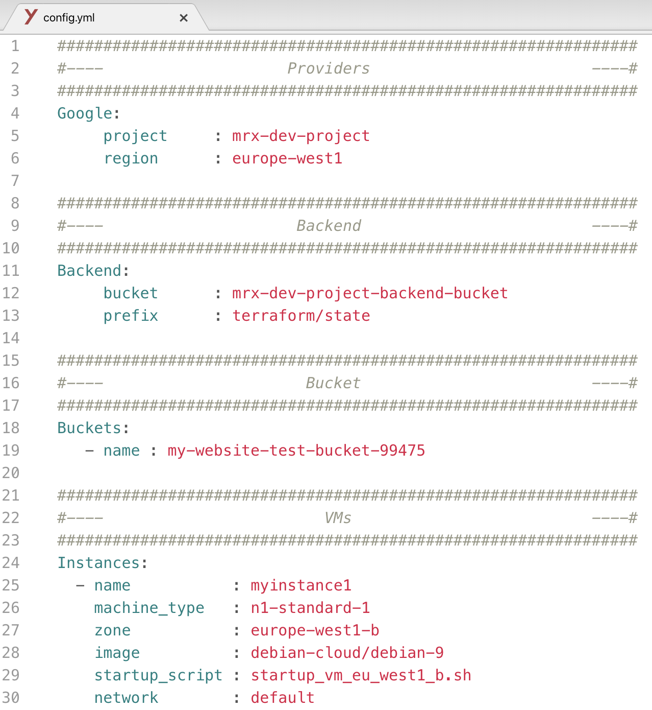

# Infrastructure automation on Google Cloud Platform

## What you need to know before guetting started ?
1. Google Cloud Platform
2. Terraform & IaC
3. Pipelines on Cloud Build

## Breif introduction

A Cloud builder is a container image with commun language and tools installed in them. 

[Cloud Build](https://cloud.google.com/cloud-build) makes use of [Cloud builders](https://cloud.google.com/cloud-build/docs/cloud-builders) to perform the steps you define in the Cloudbuild.yaml file, check the link below to know more about writing Cloudbuild.yaml, some of the native builders are gcloud, docker, mvn, etc. The complete list of supported builders for Cloud Build is [here](https://github.com/GoogleCloudPlatform/cloud-builders).

## What is Infrastructure-Builder ?

Infrastructure-builder is a custom builder that runs Terraform, go and python.

## How this works ?

When you push your IaC to container registery Infrastructure-builder will execute the following pipeline:

1. **Templating** : Infrastructure-builder supports __jinja templating__, your infrastructure variables should be in a yaml format (a yaml file/environment):

## How to set up infrastructur builder in my GCP project ?
