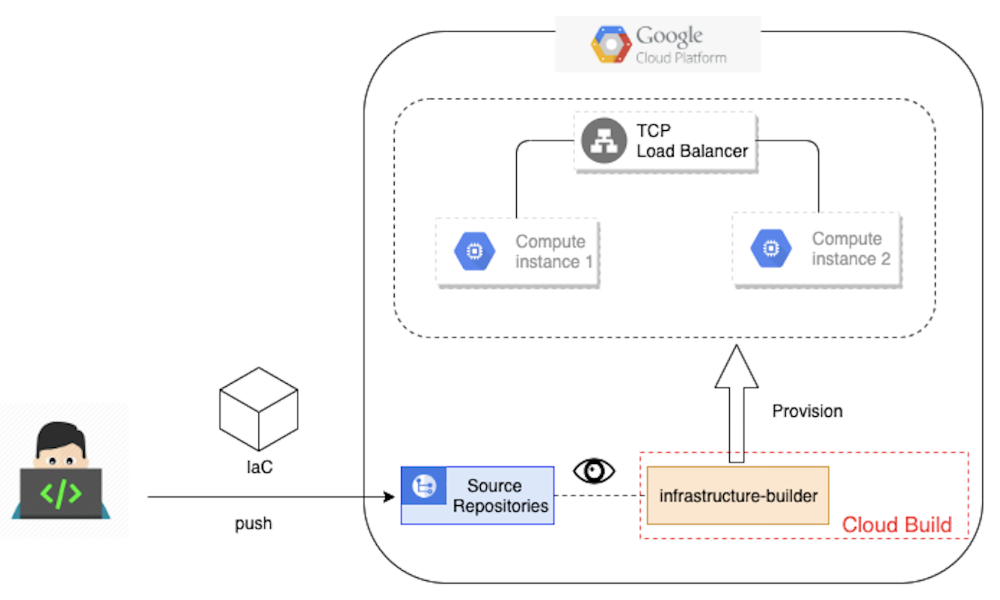
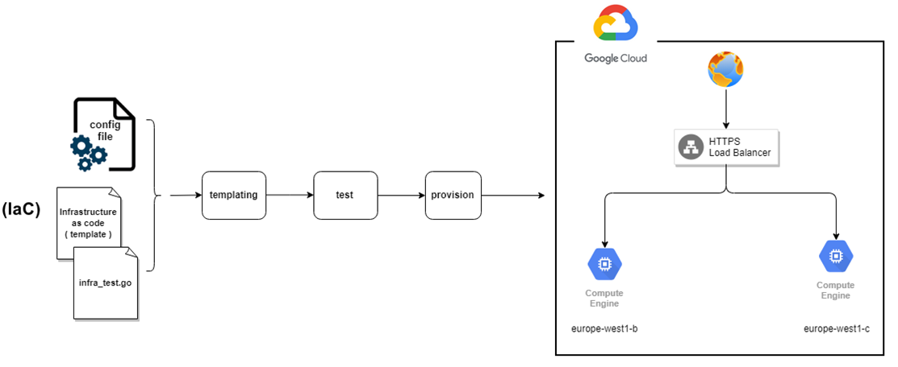
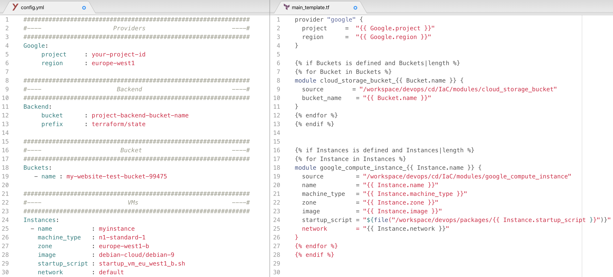
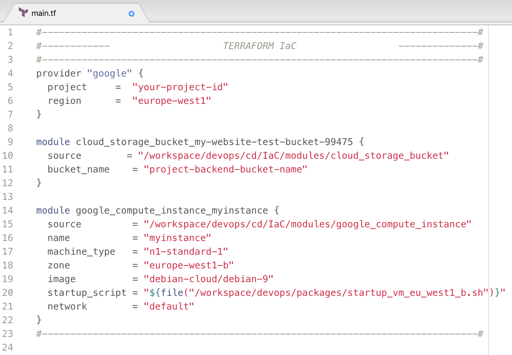

# Infrastructure automation on Google Cloud Platform

## What you need to know before guetting started ?
1. Google Cloud Platform
2. Terraform & IaC
3. Pipelines on Cloud Build

## Brief introduction

A Cloud builder is a container image with commun language and tools installed in them. 

[Cloud Build](https://cloud.google.com/cloud-build) makes use of [Cloud builders](https://cloud.google.com/cloud-build/docs/cloud-builders) to perform the steps you define in the Cloudbuild.yaml file, check the link below to know more about writing Cloudbuild.yaml, some of the native builders are gcloud, docker, mvn, etc. The complete list of supported builders for Cloud Build is [here](https://github.com/GoogleCloudPlatform/cloud-builders).

## What is Infrastructure-Builder ?

Infrastructure-builder is a custom builder that runs Terraform, go and python.

## How this works ?

### Overview : 

### Details :
Pushing the code (IaC) to container registery should trigger cloud build which will use Infrastructure builder to execute each step of the following pipeline in order to create resources : 

1. **Templating** : A practice when writing IaC is to separate configuration from logic, i.e to group together the infrastructure variables in a **config.yaml** file (a file/environment).

Infrastructure-builder supports __jinja templating__, that's  why the first step of the automation pipeline will be feed those variables to the main code, next is an example of writing a Storage bucket and a Compute Instance with templating:      Templating step will generate the following IaC:    

## How to set up infrastructur builder in my GCP project ?
