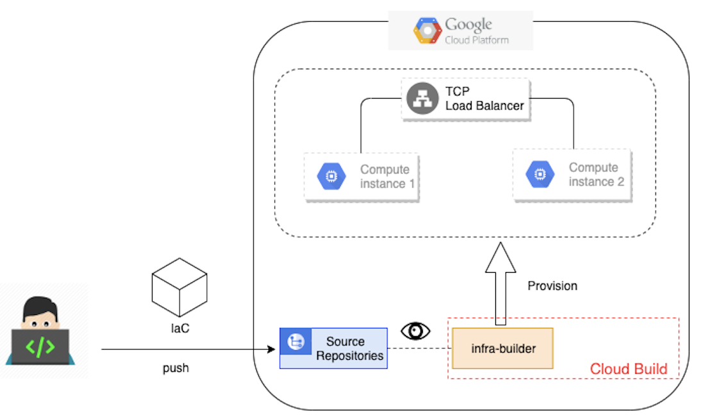

# Infrastructure automation on Google Cloud Platform

## What you need to know ?
1. Google Cloud Platform
2. Terraform & IaC
3. Pipelines on Cloud Build

## How this works ?
Very simple !

1. Set up **Infrastructure-Builder** on your project
1. Write you IaC
2. Push your IaC to a Google Cloud repository
3. **Infrastructure-Builder** will provision you resources

## What is Infrastructure-Builder ?

