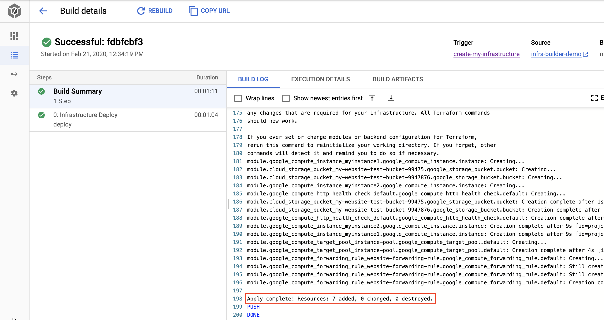

# Infrastructure automation on Google Cloud Platform

## What you need to know before guetting started ?
1. Google Cloud Platform
2. Terraform & IaC
3. Pipelines on Cloud Build

## Brief introduction

A Cloud builder is a container image with commun language and tools installed in them. 

[Cloud Build](https://cloud.google.com/cloud-build) makes use of [Cloud builders](https://cloud.google.com/cloud-build/docs/cloud-builders) to perform the steps you define in the Cloudbuild.yaml file, check the link below to know more about writing Cloudbuild.yaml files. 

Some of the native builders are gcloud, docker, mvn, etc. The complete list of supported builders for Cloud Build is [here](https://github.com/GoogleCloudPlatform/cloud-builders).

## What is Infrastructure-Builder ?

Infrastructure-builder is a custom builder that runs Terraform, go and python.

## How this works ?

### Overview : 

### Details :
Pushing the code (IaC) to container registery should trigger cloud build which will use Infrastructure builder to execute each step of the following pipeline in order to create resources : 

#### Templating :
Templating is a good idea when you would like to create the same resource several times with different parameters.
A best practice when writing IaC is to separate configuration from logic, i.e to group together the infrastructure variables in a **config.yaml** file per environment:

Infrastructure-builder supports __jinja templating__, The step before provisioning is to feed those variables into the main code, next is an example of writing a Storage bucket and a Compute Instance with templating:

Templating step will generate the following IaC:    

#### Provisioning : 
Provisioning will simply run different Terraform commands (plan, apply) to deploy infrastructure.

Templating and Provioning are embedded together in the following declaration of **Cloudbuild.yaml** within your project :

The step supports one of the following argument : 
- __dry-deploy__: Infrastructure_builder will preform templating then terraform **plan** 
- __deploy__: Infrastructure_builder will preform templating then terraform **apply** 
- __clean__: Infrastructure_builder will preform templating then terraform **destroy** 

## How to set up infrastructur builder in my GCP project ?
Infrastructure builder should be available in conatiner registery within your project.

The tool will inherit permissions from Cloud Build.  So make sure to grant Cloud build sufficient permissions to be able to create resources in your project.

See full set up instructions.

## Demo :

In this demo we will deploy the following infrastructure :

Two compute instances, each one of them will run a different startup script to install apache web server and modify index.html so that instance 1 will return **Hello from Belgium**, instance 2 will return **Hello from London** (based on the geographic location), group together the two instances in a node pool and create a TCP Load Balancer to route the income trafic to the node pool just created.

1) Make sure infrastructure-builder is available in your project and that Cloud build has sufficient permissions to create resources.

2) Create a Google storage backet to be used as a backend for Terraform

2) Clone this repository.

__Notice__ : all folders are optionals except **DevOps**. It should be in the repository **root** folder and has the following structure:

**modules** folder (optional): contains resource modules (in case you are writing modular IaC).

Folders in **config/** represents your environments (dev, staging, prod, etc), each folder has a config.yaml file.

If you are devoloping the same Infrastructure for different environments than your config file should be in **config/\<your environment name>**

You tell infrastructure builder about which config file to use by setting he ENV variable in **Cloudbuild.yaml**.

3) Create a repository on Google Cloud Repositories in your project

4) Set up a trigger in cloud build and set ”Cloud Source Repository” as a repository hosting option

5) Select the repository you created in step 3

6) In the trigger settings Select ”Cloud  Build  configuration file (yaml or json)” as a build configuration and remain other settings to the default

7) Set "Cloud build configuration file" to **/devops/Cloudbuld.yaml**

8) Set <your-project-id> in Cloudbuild.yaml, change the backend bucket name in config.yaml
  
9) Commit and push to the repository created in step 3. 
  
Check Cloud build history, resources should be created successefully :

